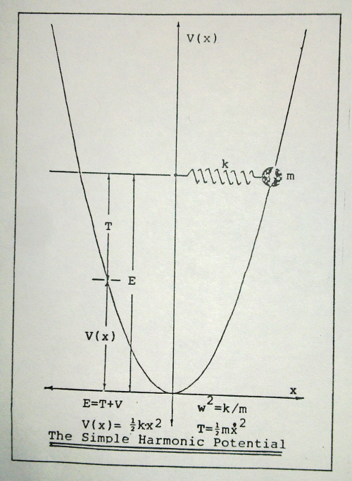

## Review of the Simple Harmonic Oscillator in Classical Mechanics

Newton's equation states that the product of a particle's mass and acceleration is equal to
the force that is accelerating the particle:

    F = ma = m(d²/dt²)x   # 2.1

> Look at that! `d²/dt²`?  Clearly means the second derivative with respect to time.
> But as a language... why is that not `d*d/(d*t*t)`?
> I was finding it impossible to type out my thesis on a regular typewriter
> (a mechanical device used to write on paper).
> So I ended up buying what was at the time a very nice electric typewriter with switchable
> type font disks to write greek letters and superscripts...
> I think it even allowed one to edit a line at a time.
> It must have been able to, because I could not type out a line without a typo.
> Seriously! I nearly dropped out because of this here damn paper.

For the case in which the force is proportional to a displacement `x` of the particle,
the equation of motion reads

    m(d²/dt²)x = -kx,   # 2.2

where `k` is the proportionality constant.
This is the equation given to the mass on a spring problem, and thus
`k` is often time called the spring constant.
This is a second order linear differential equation, and therefore
it has two solutions from which all other solutions can be formed:

    x₁ = sin[ωt] ≐ s₁           # 2.3a
    x₂ = cos[ωt] ≐ c₁           # 2.3b
    x = Ax₁ + Bx₂ = As₁ + Bc₁   # 2.3c

> Some language issues here too.
> I'm refering to sine and cosine functions, not `s*i*n` or `c*o*s`.
> You might think that the meaning is clear.
> But later you'll see that I'm struggling to deal with really long equations, and
> terseness and unambiguous expressions are going to be extremely important!
> Also, semantically we expect the term being defined on the left of the definition,
> like `s₁≐...`.  So to be clear, I'm defining `s₁` and `c₁`.
> Later I'll be dealing with `sin[nωt]` and `cos[nωt]` which
> for terseness I'll write `sₙ` and `cₙ`.

`A` and `B` are arbitrary complex constants.
The frequency of oscillation `f` is given by

    f = ω/(2π)   # 2.4a

and

    ω² = k/m.    # 2.4b

> The above two equations defines the relationship between `k`, `w`, and `f`.
> I should have used a definition sign, ≐.
> Of course, for a real mass on a spring problem, `A` and `B` are Real numbers.
> It does seem a bit odd to me now that the general solution allows for complex amplitudes, and
> if it does to you too you can check derivation in the [addendum](ADDENDUM.md).

Forces are due to the gradient of a potential `V[x]`.
The potential energy of a particle is that energy due solely to the position for the particle.
The simple harmonic potential is given by

    V[x] = ½kx².   # 2.5

Thus, the total energy of a particle is given by
the sum of its kinetic `T` and potential `V` energy,

    E = T + V = ½m(dx/dt)² + ½kx²;   # 2.6

and its motion is given by

~~x[t] = (E/k)sin[ωt] ⇐  x[0]=0   # 2.7~~

    x[t] = √(2E/k)sin[ωt] ⇐ x[0]=0   # 2.7

> Even after setting `E`, `k`, and `w`, we still need to set the initial conditions,
> which is what `x[0]=0` is about.
> Apparently I don't have the final draft.
> I have the first line typed, and corrected in pencil the second expression.
> So which one is it?
```
x = X:Sine[ωt]           # consider solution 2.7
E = ½mẋ² + ½k(XS[ωt])²   # substitute into 2.6
E = 0 + ½kX²             # at the point of greatest displacement(K=0 & T=E)
E = ½kX²
2E = kX²
2E/k = X²
√(2E/k) = X
X = √(2E/k)              # OK, so pencil wins!  :)
```
> `:Sine` is how I currently express multiletter operators(variables, etc), and
> if used immediatly after, `S` is assumed to be defined as `:Sine`.
> Note the little dot on top of `ẋ` which means the first derivative of `x` with respect to time.

> And a nice graph follows...
> Took a picture with my Nokia N900. Should I have dug out my scanner for this? Nah...
> I don't remember where the graph is from.  I don't think I made it.


